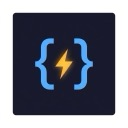

# ⚡ CodeRadar

A Chrome extension that adds **smart autocomplete** to LeetCode's Monaco code editor — powered by a Trie data structure.



## ✨ Features

- 🌳 **Trie-based autocomplete** — Extracts identifiers from your code via regex, stores them in a Trie, and provides instant prefix-based suggestions
- 🌐 **Language-aware keywords** — Built-in dictionaries for **Python**, **JavaScript**, **Java**, and **C++** (including LeetCode types like `ListNode`, `TreeNode`)
- 🎨 **VS Code-style popup** — Glassmorphic suggestion panel with icon categorization, frequency badges, and prefix highlighting
- ⌨️ **Keyboard navigation** — `↑`/`↓` to navigate, `Tab`/`Enter` to accept, `Esc` to dismiss
- 🔄 **Real-time updates** — Trie rebuilds as you type, picking up new variables and functions
- 📱 **SPA-aware** — Handles LeetCode's single-page navigation between problems
- 🔒 **Zero CSP issues** — 100% DOM-based, no page context injection needed

## 📁 Project Structure

```
coderadar/
├── manifest.json          # Chrome Extension Manifest V3
├── src/
│   ├── trie.js            # Trie data structure with frequency tracking
│   ├── tokenizer.js       # Regex tokenizer + language keyword dictionaries
│   ├── popup.js           # Autocomplete popup UI component
│   └── content.js         # Main orchestrator (DOM-based, no bridge)
├── styles/
│   └── popup.css          # Dark glassmorphic styling
├── icons/
│   ├── icon16.png
│   ├── icon48.png
│   └── icon128.png
├── .gitignore
└── README.md
```

## 🚀 Installation

1. **Clone** this repo:
   ```bash
   git clone https://github.com/YOUR_USERNAME/coderadar.git
   ```

2. Open Chrome → navigate to `chrome://extensions/`

3. Enable **Developer mode** (toggle in top-right)

4. Click **Load unpacked** → select the cloned folder

5. Go to any [LeetCode problem](https://leetcode.com/problems/two-sum/) and start typing!

## 🎯 Usage

| Action | Shortcut |
|--------|----------|
| Trigger suggestions | Type 2+ characters |
| Navigate up | `↑` |
| Navigate down | `↓` |
| Accept suggestion | `Tab` or `Enter` |
| Dismiss | `Esc` or click outside |

## 🏗️ Architecture

Everything runs in Chrome's **isolated content script world** — no page context injection, zero CSP conflicts.

```
┌─────────────────────────────────────────────┐
│           Content Script (Isolated World)    │
│                                             │
│  Keystroke → Word Buffer → Trie Search      │
│                              ↓              │
│  .view-line DOM → Tokenizer → Trie Build    │
│                              ↓              │
│  .cursor DOM Position → Popup Placement     │
│                              ↓              │
│  Tab/Enter → Synthetic Paste → Monaco       │
└─────────────────────────────────────────────┘
```

| Concern | Method |
|---------|--------|
| Read code | Parse `.view-line` element text content |
| Detect current word | Track keystrokes in a buffer |
| Cursor position | `.cursor` element's `getBoundingClientRect()` |
| Insert completion | Synthetic `ClipboardEvent('paste')` with `DataTransfer` |

## 🛠️ Supported Languages

| Language | Keywords | Identifiers |
|----------|:--------:|:-----------:|
| Python | 130+ | ✅ |
| JavaScript / TypeScript | 80+ | ✅ |
| Java | 100+ | ✅ |
| C++ | 120+ | ✅ |

## 🔧 Development

After editing any file:
1. Go to `chrome://extensions/`
2. Click **↻** on the extension card
3. Hard-refresh the LeetCode page (`Cmd + Shift + R` / `Ctrl + Shift + R`)

## ⚠️ Notes

- Only activates on `https://leetcode.com/problems/*`
- Reads visible code lines only (Monaco virtualizes rendering) — sufficient for typical LeetCode solutions
- Does **NOT** send any data externally — everything is local

## 📝 License

MIT
